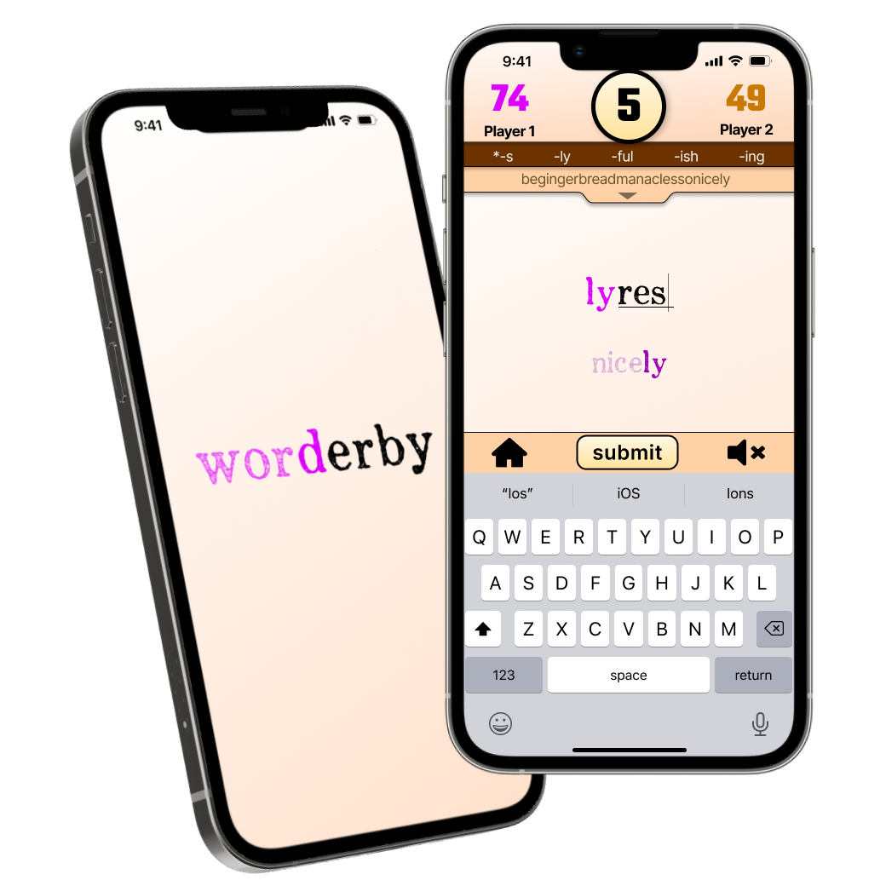

  

# Worderby 2.0 - In Development

Worderby is a competitive 2-player mobile word game (both iOS + Android) where you continuously chain words off of the last word played in order to score points. The game can be played as multiplayer online across devices or as a single-player against Worderbot (the game's AI bot).

View [Worderby 1.0](https://github.com/ArkfulDodger/worderby-v1/tree/main) to see full game breakdown.

[Version 1.0 90-second Demo](https://youtu.be/MjrI8v3S0LU)

If you would like to take part in playtesting, please contact me here or via my [LinkedIn](https://www.linkedin.com/in/noah-reece/).

***

# Main Tech Stack

This app is built in **React Native**, written in **TypeScript**, utilizing an **Expo Managed Workflow**.

State Management - **Redux**.

Navigation - **Expo Router**.

Back End - **Supabase** (BaaS)
